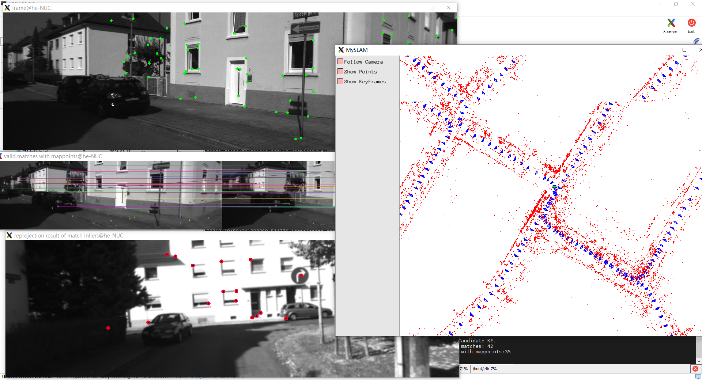
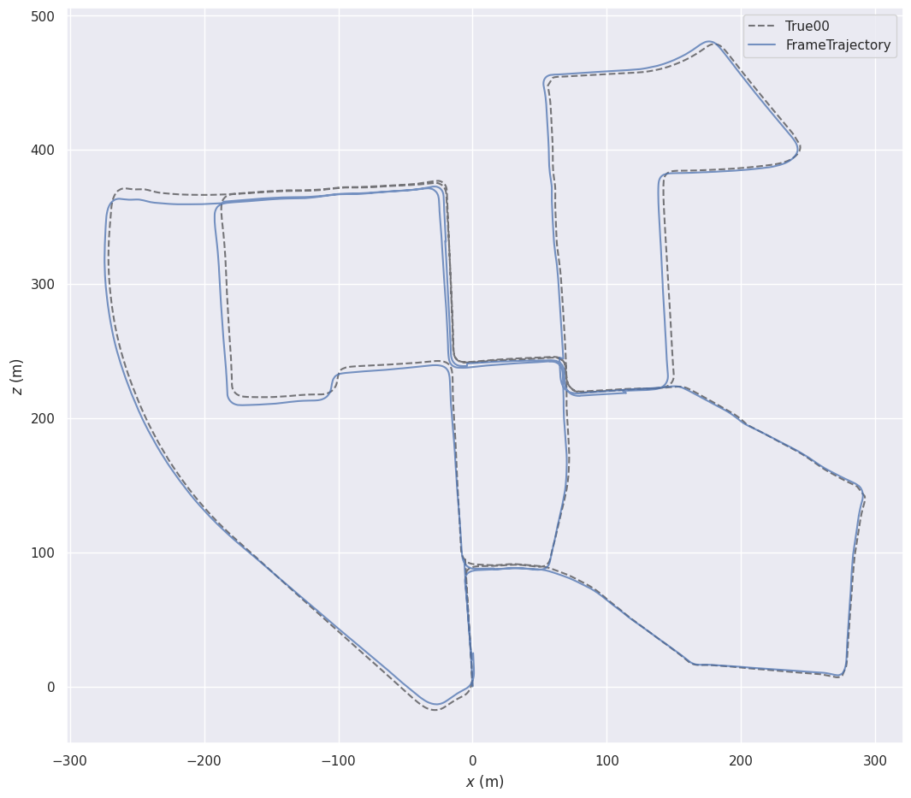

# A Simple Stereo SLAM System with Deep Loop Closing

This is a simple stereo SLAM system with a deep-learning based loop closing module. As a beginner of SLAM, I made this system mainly in order to practice my coding and engineering skills to build a full SLAM system by myself. 

I chose to build this system based on stereo cameras because it is easiler, without complicated work on initialization or dealing with the unknown scale. The structure of the system is simple and clear, in which I didn't apply much detailed optimization. Thus, the performance of this system is not outstanding. However, I hold the view that such a simple structure may be friendly for a SLAM beginner to study the body frame of a full SLAM system. It will be definitely a tough work for a beginner to study, for example,  ORB-SLAM2, a complex system with more than 10 thousand lines of code and a lot of tricks to improve its performance. 

Construct a lightweight binocular visual SLAM system consisting of front-end odometry, back-end local mapping, and global loop closure optimization. The system integrates the high precision of traditional geometric vision (PnP + BA) and the appearance robustness of deep learning (illumination change resistance). It employs the optical flow method to improve front-end tracking efficiency and embeds the CALC self-supervised depth network to replace the traditional bag-of-words model, effectively mitigating loop closure failure under complex illumination and viewpoint variations.

## Related References

### Chapter 13, Visual SLAM: From Theory to Practice
(https://github.com/gaoxiang12/slambook-en), I use the basic framework of the Stereo VO in the chapter, and the main methods in the frontend and the backend threads.

### ORB-SLAM2
(https://github.com/raulmur/ORB_SLAM2), I use some modified code in ORB-SLAM2 (mainly from ORBextractor.cpp for ORB feature extracting). 

### Lightweight Unsupervised Deep Loop Closure
(https://github.com/rpng/calc), I use modified versions of the DeepLCD library to perform loop detection.

## Dependencies

The platform I use is Ubuntu 20.04.

### OpenCV

Dowload and install instructions can be found [here](https://opencv.org/releases/). I am using OpenCV 3.4.8.

### Eigen

Dowload and install instructions can be found [here](https://opencv.org/releases/). You can just use 
``` sudo apt-get install libeigen3-dev ```
to install it in Ubuntu.

### Sophus
Dowload and install instructions can be found [here](https://github.com/strasdat/Sophus). I am using Sophus 1.0.0.

### g2o
Dowload and install instructions can be found [here](https://github.com/RainerKuemmerle/g2o).

### Caffe
The CPU verion is enough. Dowload and install instructions can be found [here](http://caffe.berkeleyvision.org/install_apt.html). This is the dependency of DeepLCD library.

NOTICE: Please make sure your caffe is installed in ~/caffe, or you need to change its path in CMakeLists.txt.

### DeepLCD
This is the library for deep loop detection. The modified library are included in the project, so you don't need to install it by yourself.

### Pangolin
Dowload and install instructions can be found [here](https://github.com/stevenlovegrove/Pangolin). I am using Pangolin 0.6, same with ORB-SLAME2.

### Others
* C++17
* Boost filesystem
* Google Logging Library (glog)

TIPS: There may be some dependencies I missed. Please open an issue if you face any problem.

## Build

Clone the repository:
```
git clone https://github.com/liuhestu/StereoSLAM-with-DeepLoopClosing.git
```

Build:
```
mkdir -p build && cd build
cmake ..
make
```

This will create libmyslam.so in /lib folder and the executables in /bin folder.

## Run the example

Up to now I have just written the example to run KITTI Stereo. The main file is at /app/run_kitti_stereo.

First, download a sequence from [KITTI Database]( http://vision.in.tum.de/data/datasets/rgbd-dataset/download), or you can download it from [Baidu Netdisk link](https://www.sohu.com/a/219232053_715754) shared by Pao Pao Robot in China.

To run the system on KITTI Stereo sequence 00:
```
./bin/run_kitti_stereo  config/stereo/gray/KITTI00-02.yaml  PATH_TO_DATASET_FOLDER/dataset/sequences/00
```

where KITTI00-02.yaml is the corresponding configuration file (including camera parameters and other parameters). It utilizes the style of ORB-SLAM2. 
<div align="center">
	
</div>

Besides, some parameters in configuration file are for viewing:
* Camera.fps: control the frame rate of the system
* LoopClosing.bShowResult: whether to show the match result and reprojection result in Loop Closing
* Viewer.bShow: whether to show the frame and map in real time while system running

Here is a result of all frame trajectory in KITTI 00.

```
evo_traj tum result/FrameTrajectory.txt --ref=ground_truth/True00.txt -p --plot_mode=xz
```

<div align="center">
	

</div>

The system can run at a frame rate of around 100 frames per second if the viewer is closed. Run on a NUC with 13th Intel i7-1360P (2.60GHz × 16) and no GPU acceleration.

# Brief Introduction

The system contains three thread:
* Frontend thread
* Backend thread
* LoopClosing thread

Front-end OdometryExtract uniform ORB feature points with reference to the octree strategy in ORB-SLAM, implement KLT optical flow tracking drawing on the OpenVINS front-end algorithm, and construct a Motion-only BA using g2o that only optimizes the pose of the current frame to reduce computational overhead.

Back-end Local OptimizationBuild a sliding window-based local map, dynamically maintain active keyframes and landmarks, and perform local bundle adjustment constrained by out-of-window keyframes. This optimizes the poses of keyframes and coordinates of feature points within the window, reducing odometry drift.

Loop Detection and Global OptimizationUse the pre-trained CALC self-supervised convolutional network to extract global feature vectors from keyframe images, and quickly retrieve loop candidate frames by calculating vector cosine similarity, improving loop recall rate in environments with illumination changes.Upon loop closure triggering, ORB descriptors are recomputed and matched. RANSAC-PnP is adopted to eliminate mismatched points and solve the relative pose of the current keyframe. Finally, a global pose graph optimization is constructed with loop closure edges to perform consistent correction on historical trajectories and global map points.

***

There must be some mistakes in the project as I am just a newcomer to visual SLAM. Please open an issue if you find any problem, and I will be deeply grateful for your correction and advice.

## Evaluation scripts

A combined evaluation script is provided at `loop_comparation/tool/metrics_and_plot.py`. It computes TP/FP/Precision/Recall/AP, saves per-method `*_scores_labels.csv`, writes a PR curve `pr_curve.png`, and writes metrics into `metrics_full.txt` or `metrics_key.txt` under the specified output directory.

Example (full results):
```bash
python3 loop_comparation/tool/metrics_and_plot.py \
	--results_dir /home/he/deeploop_slam/loop_comparation/full \
	--gt /home/he/deeploop_slam/ground_truth/True00.txt \
	--min_gap 50 --dist_thresh 3.0 --outdir /home/he/deeploop_slam/loop_comparation/full
```


